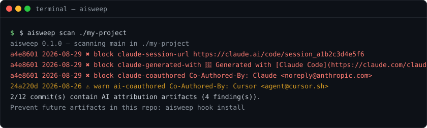
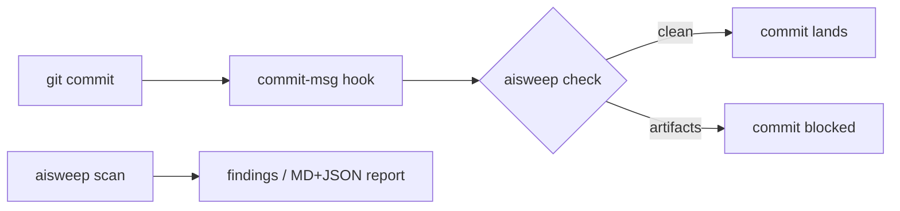

<div align="center">

# aisweep

**AI attribution artifacts, swept out of your git history.**

Find and block the session URLs, `Generated with Claude Code` lines and AI
co-author trailers that AI coding agents leave in your commits — for developers
who use Claude Code, Cursor, Copilot, Aider, Gemini CLI or Codex and publish
clean repositories.

[](https://github.com/w1977-0/ai-commit-sweeper/actions/workflows/ci.yml)
[](LICENSE)
[](pyproject.toml)
[](https://github.com/astral-sh/ruff)
[](CHANGELOG.md)
[](https://github.com/w1977-0/ai-commit-sweeper/stargazers)

**English** | [简体中文](README.zh-CN.md)



</div>

## Why this exists

AI coding agents sign your commits by default, whether you asked for it or not.
Claude Code appends a **session URL** (`https://claude.ai/code/session_…`) plus
a *Generated with Claude Code* line and a `Co-Authored-By: Claude` trailer to
every commit and PR description it writes — silently, opt-out, discoverable
only after it is already in your history
([anthropics/claude-code#66504](https://github.com/anthropics/claude-code/issues/66504),
89 👍 as of August 2026, and a lively
[HN thread](https://news.ycombinator.com/item?id=49498201)).

Claude Code now has a setting to turn this off per tool. That still leaves:

1. **history already written** — the artifacts stay in every past commit;
2. **every other tool** — Cursor, Copilot, Aider & friends each have their own
   behaviour and their own switch;
3. **teammates** — whose `~/.claude/settings.json` you do not control.

`aisweep` is the one tool-agnostic gate: **audit** what is already in your
history, and **block** polluted commits before they land.

## Features

| | |
| --- | --- |
| 🔍 **Audit** | scan full history (or any range) for AI artifacts, per-commit report |
| 🛡️ **Prevent** | a `commit-msg` hook stops polluted commits before they land |
| 🧰 **Tool-agnostic** | pattern-based — works with any agent, including future ones |
| 🧩 **Configurable** | `.aisweep.json`: disable rules, tune severity, allowlist, add your own |
| 📤 **Reports** | Markdown + JSON output for CI, PR review or pre-open-sourcing checks |
| 🪶 **Zero dependencies** | Python ≥ 3.10 standard library only; `pip install` and go |
| 🤝 **Non-destructive** | never rewrites, amends or touches a single commit |

## Quick start

Prerequisites: Python 3.10+ and git.

```bash
# install
pip install git+https://github.com/w1977-0/ai-commit-sweeper.git
# or isolated:  pipx install git+https://github.com/w1977-0/ai-commit-sweeper.git
# or without installing:
git clone https://github.com/w1977-0/ai-commit-sweeper git clone https://github.com/w1977-0/ai-commit-sweeper && cd aisweepgit clone https://github.com/w1977-0/ai-commit-sweeper && cd aisweep cd ai-commit-sweeper && python -m aisweep --help
```

```bash
# 1. audit a repository
aisweep scan ./my-project

# 2. prevent future artifacts
cd ./my-project
aisweep hook install
```

## Usage

### Audit existing history

```console
$ aisweep scan ./my-project
aisweep 0.1.0 — scanning main in ./my-project
  a4e8601 2026-08-29 ✖ block claude-session-url     https://claude.ai/code/session_a1b2c3d4e5f6
  a4e8601 2026-08-29 ✖ block claude-generated-with  🤖 Generated with [Claude Code](https://claude.com/claude-code)
  a4e8601 2026-08-29 ✖ block claude-coauthored      Co-Authored-By: Claude <noreply@anthropic.com>
  24a220d 2026-08-26 ⚠ warn  ai-coauthored          Co-Authored-By: Cursor <agent@cursor.sh>
2/12 commit(s) contain AI attribution artifacts (4 finding(s)).
Prevent future artifacts in this repo: aisweep hook install
```

Exit code is `1` when artifacts are found, so it drops into CI and scripts
directly. Useful flags: `--all` (scan all refs), `--rev`, `--since`,
`--max N`, `--json`, `-o REPORT.md`.

### Block polluted commits before they land

```console
$ aisweep hook install
commit-msg hook installed at .git/hooks/commit-msg (default (block-level rules only))

$ git commit --allow-empty -m "fix: quick patch" -m "https://claude.ai/code/session_zz9x8y7w6v"
aisweep: commit message contains AI attribution artifacts:
  ✖ block claude-session-url     https://claude.ai/code/session_zz9x8y7w6v
commit blocked. Edit the message (drop the artifacts or configure .aisweep.json), then commit again.

$ git commit --allow-empty -m "fix: quick patch"   # clean messages pass
```

The hook enforces **your** policy: `--strict` also blocks warn-level rules, and
`.aisweep.json` can flip any rule either way.

### Shareable reports

```console
$ aisweep report ./my-project -o REPORT.md --json-output REPORT.json
report: 4 finding(s) across 12 commit(s) -> REPORT.md
```

Markdown for humans, JSON for machines — handy before open-sourcing a repo
that was built with AI assistance.

## Default rules

| Rule | Severity | Catches |
| --- | --- | --- |
| `claude-session-url` | block | session URLs like `https://claude.ai/code/session_…` ([#66504](https://github.com/anthropics/claude-code/issues/66504)) |
| `claude-generated-with` | block | the *Generated with Claude Code* attribution line |
| `claude-coauthored` | block | `Co-Authored-By: Claude <noreply@anthropic.com>` trailers |
| `ai-coauthored` | warn | `Co-Authored-By` trailers naming other agents (Cursor, Copilot, Aider, Gemini, Codex, …) |
| `ai-generated-with` | warn | *Generated with \<tool\>* lines for other agents |

Matching is case-insensitive and line-anchored, so ordinary prose (a link to
the docs, a colleague named "Claude" in a normal co-author line) is not swept
up by accident. See [configuration](#configuration) for the escape hatches.

## Configuration

`aisweep init` writes a starter `.aisweep.json` at the repository root:

```json
{
  "disable": ["ai-coauthored"],
  "severities": {"ai-coauthored": "block"},
  "allow_patterns": ["^co-authored-by:.*\\bmy-team-bot\\b"],
  "extra_rules": [
    {
      "id": "acme-deploy-bot",
      "description": "our deploy bot trailer",
      "pattern": "^deployed-by: acme-bot",
      "severity": "warn"
    }
  ]
}
```

- **disable** — switch built-in rules off (e.g. your team *wants* attribution).
- **severities** — per-rule `block` / `warn` override.
- **allow_patterns** — lines matching these regexes never produce findings.
- **extra_rules** — your own patterns, compiled like the built-ins
  (case-insensitive, multiline).

## How it works



`scan` reads commit messages via `git log` and matches every line against the
effective ruleset; `check` does the same for a single message file inside the
`commit-msg` hook. aisweep is **read-only**: it never rewrites, amends or
stages anything.

## FAQ

**Does it rewrite my history?**
No — that is out of scope by design. Use [git-filter-repo](https://github.com/newren/git-filter-repo)
for rewrites; aisweep gives you the precise map of what to rewrite and keeps
new pollution out afterwards.

**Is this anti-AI?**
No. The request behind [#66504](https://github.com/anthropics/claude-code/issues/66504)
is that attribution should be *opt-in*. aisweep enforces exactly that: your
repository, your policy. If your team wants attribution, configure it in.

**What about false positives?**
Patterns are narrow and line-anchored; anything that slips through can be
allowed via `allow_patterns` or downgraded via `severities`.

**Does it work on Windows?**
`scan`, `check` and `report` run anywhere Python 3.10+ runs. The hook is a
POSIX shell script and works in Git Bash environments. CI tests on Linux.

**Which tools does it cover?**
Any tool whose artifacts end up in commit messages — the rules match shapes,
not vendors, and `extra_rules` covers anything we missed.

## Roadmap

- [ ] Publish to PyPI
- [ ] GitHub Action wrapper (scan a repo in CI without installing)
- [ ] HTML report with filtering
- [ ] PR-description audit via GitHub API
- [ ] [pre-commit](https://pre-commit.com/) framework integration

## Contributing

Issues, bug reports and PRs are welcome — see
[CONTRIBUTING.md](CONTRIBUTING.md) for the development setup, commit style and
test requirements. Please note the [Code of Conduct](CODE_OF_CONDUCT.md) and
the [security policy](SECURITY.md).

## License

[MIT](LICENSE) © 2026 w1977-0

## Acknowledgments

- [anthropics/claude-code#66504](https://github.com/anthropics/claude-code/issues/66504) —
  the feature request that documented the default-on session URL behaviour
- the [Hacker News thread](https://news.ycombinator.com/item?id=49498201) that
  surfaced how many people care about this
- [git-filter-repo](https://github.com/newren/git-filter-repo) — the right tool
  for the rewriting part aisweep deliberately leaves out
- [Contributor Covenant](https://www.contributor-covenant.org/) — our Code of
  Conduct template
