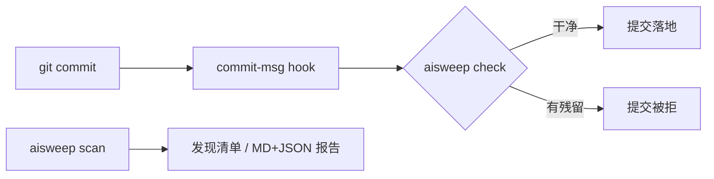

<div align="center">

# aisweep

**把 AI 提交残留从你的 git 历史里扫出去。**

审计并拦截 AI 编程代理留在 commit 里的 session URL、`Generated with Claude Code`
署名行和 AI Co-Author 尾注——适合使用 Claude Code、Cursor、Copilot、Aider、
Gemini CLI、Codex，并且想把干净仓库发布出去的开发者。

[](https://github.com/w1977-0/ai-commit-sweeper/actions/workflows/ci.yml)
[](LICENSE)
[](pyproject.toml)
[](https://github.com/astral-sh/ruff)
[](CHANGELOG.md)
[](https://github.com/w1977-0/ai-commit-sweeper/stargazers)

[English](README.md) | **简体中文**


</div>

## 为什么做这个

AI 编程代理默认会给你的 commit「签名」。Claude Code 会在它写的每一条 commit
消息和 PR 描述末尾自动附加 **session URL**（`https://claude.ai/code/session_…`）、
*Generated with Claude Code* 署名行和 `Co-Authored-By: Claude` 尾注——不打招呼、
默认开启、等你发现时历史里已经有了
([anthropics/claude-code#66504](https://github.com/anthropics/claude-code/issues/66504)，
截至 2026 年 8 月获 89 个 👍，[HN 讨论](https://news.ycombinator.com/item?id=49498201)
也很热烈)。

现在 Claude Code 加了关闭开关，但依然剩下三件事：

1. **存量历史不会自愈**——已经写进历史里的残留还在每一个旧 commit 里；
2. **其他工具各管各的**——Cursor、Copilot、Aider 各有自己的行为和各自的开关；
3. **队友不受你控制**——你管不到别人机器上的 `~/.claude/settings.json`。

`aisweep` 是一个与具体工具无关的统一闸门：**审计**历史里已有的残留，
**拦截**还没落地的污染提交。

## 功能

| | |
| --- | --- |
| 🔍 **审计** | 扫描全部历史（或任意区间），逐 commit 报告残留 |
| 🛡️ **拦截** | `commit-msg` 钩子在污染提交落地前拒掉它 |
| 🧰 **工具无关** | 基于模式匹配——任何代理都适用，包括未来的 |
| 🧩 **可配置** | `.aisweep.json`：停用规则、调整级别、白名单、自定义规则 |
| 📤 **报告** | Markdown + JSON 输出，用于 CI、PR 评审或开源前自查 |
| 🪶 **零依赖** | 仅用 Python ≥ 3.10 标准库，`pip install` 即用 |
| 🤝 **非破坏性** | 绝不改写、绝不 amend、绝不碰任何一个 commit |

## 快速开始

前置要求：Python 3.10+ 和 git。

```bash
# 安装
pip install git+https://github.com/w1977-0/ai-commit-sweeper.git
# 或隔离安装：pipx install git+https://github.com/w1977-0/ai-commit-sweeper.git
# 或不安装直接跑：
git clone https://github.com/w1977-0/ai-commit-sweeper && cd aisweep && python -m aisweep --help
```

```bash
# 1. 审计一个仓库
aisweep scan ./my-project

# 2. 拦截未来的残留
cd ./my-project
aisweep hook install
```

## 使用示例

### 审计存量历史

```console
$ aisweep scan ./my-project
aisweep 0.1.0 — scanning main in ./my-project
  a4e8601 2026-08-29 ✖ block claude-session-url     https://claude.ai/code/session_a1b2c3d4e5f6
  a4e8601 2026-08-29 ✖ block claude-generated-with  🤖 Generated with [Claude Code](https://claude.com/claude-code)
  a4e8601 2026-08-29 ✖ block claude-coauthored      Co-Authored-By: Claude <noreply@anthropic.com>
  24a220d 2026-08-26 ⚠ warn  ai-coauthored          Co-Authored-By: Cursor <agent@cursor.sh>
2/12 commit(s) contain AI attribution artifacts (4 finding(s)).
Prevent future artifacts in this repo: aisweep hook install
```

发现残留时退出码为 `1`，可以直接接入 CI 和脚本。常用参数：`--all`（扫全部
引用）、`--rev`、`--since`、`--max N`、`--json`、`-o REPORT.md`。

### 在提交落地前拦截

```console
$ aisweep hook install
commit-msg hook installed at .git/hooks/commit-msg (default (block-level rules only))

$ git commit --allow-empty -m "fix: quick patch" -m "https://claude.ai/code/session_zz9x8y7w6v"
aisweep: commit message contains AI attribution artifacts:
  ✖ block claude-session-url     https://claude.ai/code/session_zz9x8y7w6v
commit blocked. Edit the message (drop the artifacts or configure .aisweep.json), then commit again.

$ git commit --allow-empty -m "fix: quick patch"   # 干净消息直接通过
```

钩子执行的是**你的**策略：`--strict` 连 warn 级一起拦，`.aisweep.json`
可以把任何规则往两个方向调。

### 可分享的报告

```console
$ aisweep report ./my-project -o REPORT.md --json-output REPORT.json
report: 4 finding(s) across 12 commit(s) -> REPORT.md
```

Markdown 给人看，JSON 给机器读——开源一个用 AI 辅助开发的仓库之前，
先跑一份给自己兜底。

## 默认规则

| 规则 | 级别 | 捕获对象 |
| --- | --- | --- |
| `claude-session-url` | block | `https://claude.ai/code/session_…` 形态的 session URL（[#66504](https://github.com/anthropics/claude-code/issues/66504)） |
| `claude-generated-with` | block | *Generated with Claude Code* 署名行 |
| `claude-coauthored` | block | `Co-Authored-By: Claude <noreply@anthropic.com>` 尾注 |
| `ai-coauthored` | warn | 提及其他代理的 `Co-Authored-By` 尾注（Cursor、Copilot、Aider、Gemini、Codex 等） |
| `ai-generated-with` | warn | 其他代理的 *Generated with \<tool\>* 署名行 |

匹配大小写不敏感且按行锚定，普通行文（指向官方文档的链接、恰好叫 "Claude"
的正常合作者署名）不会被误扫。误伤兜底见[配置](#配置)一节。

## 配置

`aisweep init` 会在仓库根目录写一份初始 `.aisweep.json`：

```json
{
  "disable": ["ai-coauthored"],
  "severities": {"ai-coauthored": "block"},
  "allow_patterns": ["^co-authored-by:.*\\bmy-team-bot\\b"],
  "extra_rules": [
    {
      "id": "acme-deploy-bot",
      "description": "our deploy bot trailer",
      "pattern": "^deployed-by: acme-bot",
      "severity": "warn"
    }
  ]
}
```

- **disable** — 停用内置规则（比如你的团队**想要**署名）。
- **severities** — 按规则覆盖 `block` / `warn`。
- **allow_patterns** — 命中这些正则的行永不产生残留报告。
- **extra_rules** — 自定义规则，与内置规则同一套编译方式
  （大小写不敏感、多行模式）。

## 工作原理



`scan` 通过 `git log` 读取提交消息，逐行匹配生效规则集；`check` 在
`commit-msg` 钩子里对单条消息做同样的事。aisweep 是**只读**的：不改写、
不 amend、不动暂存区。

## 常见问题

**会改写我的历史吗？**
不会——这是刻意的设计边界。改历史请用
[git-filter-repo](https://github.com/newren/git-filter-repo)；aisweep 给你
精确的「要改什么」地图，改完之后防止新残留进来。

**这是反 AI 吗？**
不是。[#66504](https://github.com/anthropics/claude-code/issues/66504) 的诉求
本质是「署名应当 opt-in」。aisweep 执行的正是这一点：你的仓库，你的策略。
团队想要署名？配置里打开就行。

**会误报吗？**
模式窄且按行锚定；万一命中误伤，用 `allow_patterns` 放行、用 `severities`
降级。

**Windows 能用吗？**
`scan`、`check`、`report` 在任何能跑 Python 3.10+ 的地方都能跑。钩子是 POSIX
shell 脚本，在 Git Bash 环境下可用。CI 在 Linux 上测试。

**覆盖哪些工具？**
凡是把残留写进 commit 消息的工具都覆盖——规则匹配的是「形态」而不是「厂商」，
漏了的用 `extra_rules` 补。

## 路线图

- [ ] 发布到 PyPI
- [ ] GitHub Action 封装（CI 里免安装直接扫）
- [ ] 可过滤的 HTML 报告
- [ ] 通过 GitHub API 审计 PR 描述
- [ ] [pre-commit](https://pre-commit.com/) 框架集成

## 参与贡献

Issue、bug 报告和 PR 都欢迎——开发环境搭建、提交风格、测试要求见
[CONTRIBUTING.md](CONTRIBUTING.md)。请遵守[行为准则](CODE_OF_CONDUCT.md)；
安全漏洞走[安全策略](SECURITY.md)。

## 许可证

[MIT](LICENSE) © 2026 w1977-0

## 致谢

- [anthropics/claude-code#66504](https://github.com/anthropics/claude-code/issues/66504)——
  把默认开启的 session URL 行为写成正式 feature request 的地方
- 那条让所有人看到「原来这么多人关心这件事」的
  [Hacker News 讨论](https://news.ycombinator.com/item?id=49498201)
- [git-filter-repo](https://github.com/newren/git-filter-repo)——改写历史这件
  aisweep 刻意不做的事，交给它正合适
- [Contributor Covenant](https://www.contributor-covenant.org/)——本项目行为
  准则的模板来源
